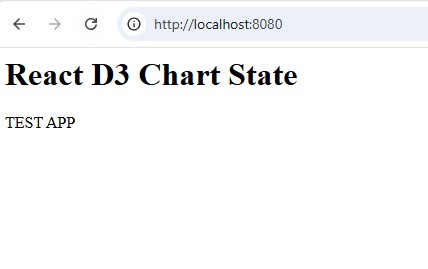

# React D3 Chart Material UI State Management Example

## Motivation

State management is one of the most challenging problems when working with charting libraries. Of course, it is easy to create a simple chart, but it gets much more complicated when you need to synchronize the state across the whole app, which contains grids, charts, and UI elements. This React, D3, Material UI app demonstrates how to address the state management problem.

## Step by step tutorial

### First we create an empty React TypeScript app with WebPack

By adding [these files](https://github.com/klishevich/blog/commit/118b24cea3e1385211be3e5eed32d81599d59a9a) we create a new project.
After running it with `npm run dev` we get this

> 

### Let us add a simple D3 chart to the page

